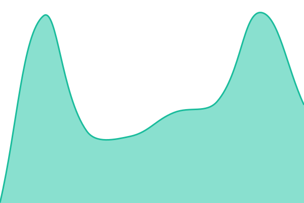
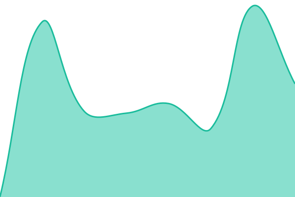

# [📈 Live Status](https://status.furcnx.com): <!--live status--> **🟧 Partial outage**

This repository contains the open-source uptime monitor and status page for [iPLAYCAFE-dev](https://status.furcnx.com), powered by [Upptime](https://github.com/upptime/upptime).

With [Upptime](https://upptime.js.org), you can get your own unlimited and free uptime monitor and status page, powered entirely by a GitHub repository. We use [Issues](https://github.com/iPLAYCAFE-dev/status-furcnx/issues) as incident reports, [Actions](https://github.com/iPLAYCAFE-dev/status-furcnx/actions) as uptime monitors, and [Pages](https://status.furcnx.com) for the status page.

<!--start: status pages-->
<!-- This summary is generated by Upptime (https://github.com/upptime/upptime) -->
<!-- Do not edit this manually, your changes will be overwritten -->
<!-- prettier-ignore -->
| URL | Status | History | Response Time | Uptime |
| --- | ------ | ------- | ------------- | ------ |
|  [Socket.IO (ping)](https://socketio.furcnx.com/v1/ping) | 🟥 Down | [socket-io-ping.yml](https://github.com/iPLAYCAFE-dev/status-furcnx/commits/HEAD/history/socket-io-ping.yml) | 

 281ms
     
 | 

<a href="https://status.furcnx.com/history/socket-io-ping">0.00%</a>
    

|  [Socket.IO (health · Neon+Upstash)](https://socketio.furcnx.com/v1/health) | 🟩 Up | [socket-io-health-neon-upstash.yml](https://github.com/iPLAYCAFE-dev/status-furcnx/commits/HEAD/history/socket-io-health-neon-upstash.yml) | 

 478ms
     
 | 

<a href="https://status.furcnx.com/history/socket-io-health-neon-upstash">100.00%</a>
    

<!--end: status pages-->

[**Visit our status website →**](https://status.furcnx.com)

## 📄 License

- Powered by: [Upptime](https://github.com/upptime/upptime)
- Code: [MIT](./LICENSE) © [Anand Chowdhary](https://anandchowdhary.com)
- Data in the `./history` directory: [Open Database License](https://opendatacommons.org/licenses/odbl/1-0/)
